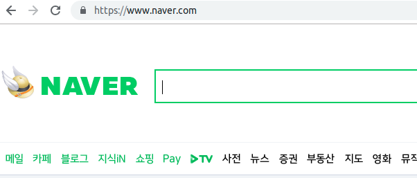
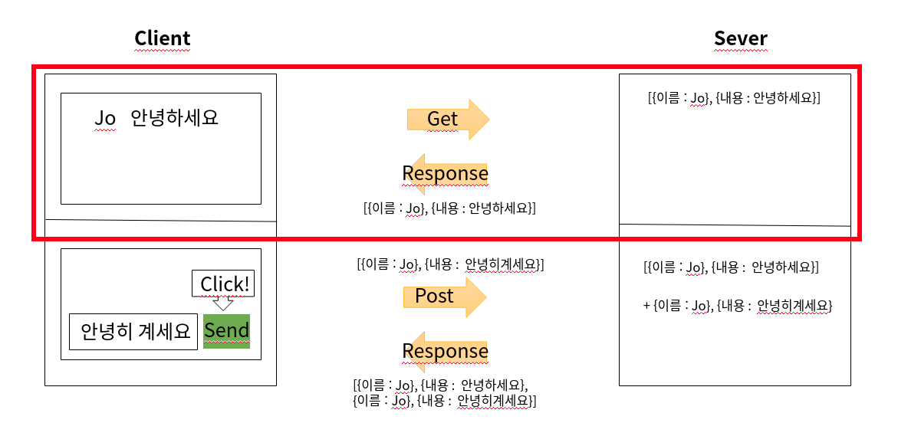
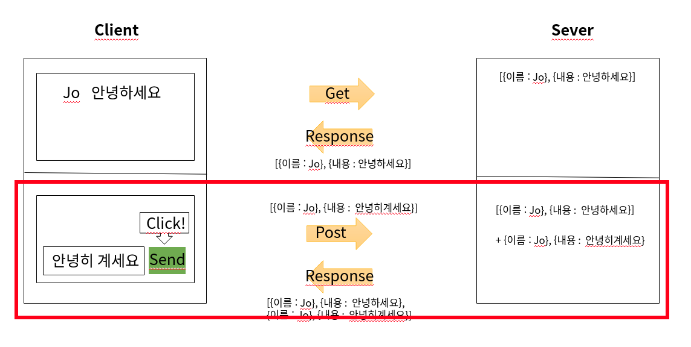

 
  
# 오늘 한 일

>  웹사이트를 접속하고 어떤 행동을 했을 때 발생되는 일들에 대해서 정리해보았다.

 

### Http

<!-- 자식이 될 녀석을 만드는 생성자에서 자신의 prototype을 부모를 바라보게 만들면 부모의 메소드들 -->
1. &nbsp; **WWW** 상에서 정보를 주고 받을 수 있는 **프로토콜**

&nbsp; 우리가 ***'어떤 사이트'***에 접속 한다고 했을 때 주소를 넣고 엔터를 치거나 링크를  
&nbsp; 클릭 하거나 브라우저 상에서의 모든 행동들은 저마다의 명령어가 되어서 서버에서 
&nbsp; 어떤 형태로든 자료를 가져오게 된다. 그 과정에서 어떤 규약이 없다면 웹사이트마다  
&nbsp; 그에 맞는 통신 방법을 다 알아야 웹사이트를 사용할수 있게 된다 . 
&nbsp; 예를 들어 한국 사람이 영어를 못하면 미국인과 대화를 못하듯이 말이다.  

 

#### Get
1. &nbsp; 처음 사이트명을 넣고 엔터를 치면 우리의 똑똑한 브라우저는 해당 도메인주소를  

&nbsp; 가지고 있는 서버에게 웹사이트 정보를 달라고 요청하게 된다. 정보를 가져오기만  

&nbsp; 할 때 우리는 Get 메서드를 통해 가져오게 된다. 

&nbsp; 그럼 서버는 처음 보여줄 웹 페이지의 정보를 Response에 담아 보내준다.  

 

#### Post

1. &nbsp; 웹페이지에서 우리는 그 사이트에 가입을 하거나 로그인을 하거나 하는 상태에 

&nbsp; 변화가 일어나는 일들을 하게 되는데 그럴 땐 Post 메서드를 통해서 내가 한 행동을  

&nbsp; 보내주고 되고 그 행동에 맞는 정보를 서버는 Response에 담아 보내준다.   

 
---

#### coment
&nbsp; 아직 내가 확실히 알고 있는지 모르겠다. 혹여나 검색에 걸려 이 글을 보고 계신다면  
&nbsp; 틀린 부분에 대해서 코멘트 달아주세요 ^^;; 
  

### 끝!